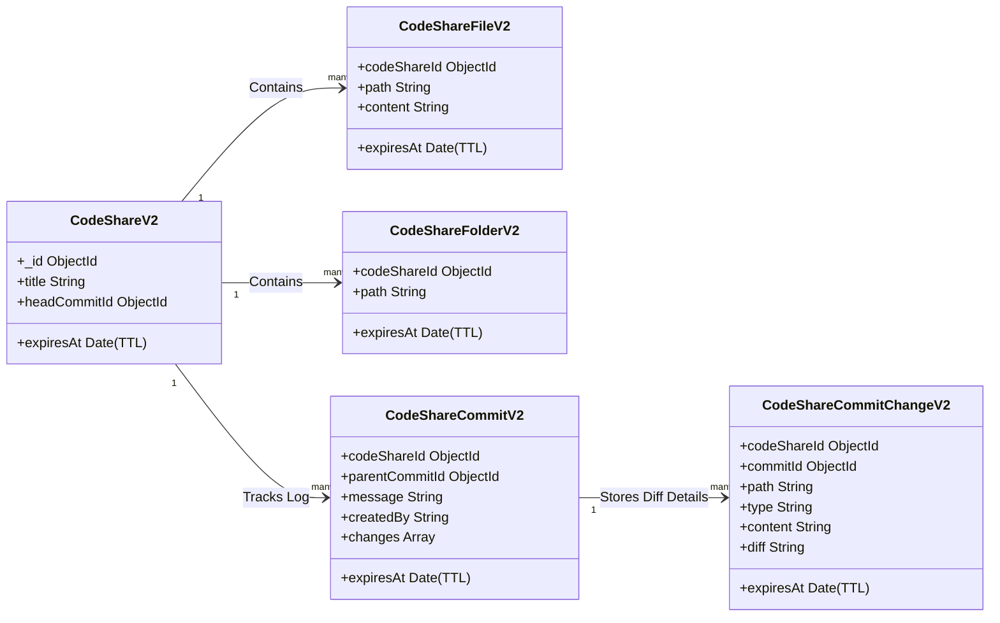
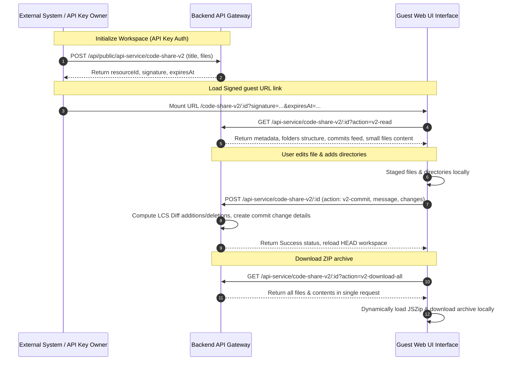

# CodeShare V2 - API Documentation & Reference Guide

CodeShare V2 is a multi-file, Git-like code-sharing platform. It allows users and systems to create project workspaces containing nested folders and files, record incremental commits with pre-computed line-by-line diffs, checkout historical versions, and download the entire workspace as a ZIP file.

This document serves as the complete technical manual for integrating with and calling the CodeShare V2 API.

---

## Table of Contents
1. [Core Architectural Concepts](#1-core-architectural-concepts)
2. [Authentication & Authorization](#2-authentication--authorization)
3. [URL Signature Generation Scheme](#3-url-signature-generation-scheme)
4. [API Endpoints Reference](#4-api-endpoints-reference)
   - [A. Management API (Resource Creation)](#a-management-api-resource-creation)
   - [B. Guest API (Signed URL Actions)](#b-guest-api-signed-url-actions)
     - [1. Read Workspace (`v2-read`)](#1-read-workspace-v2-read)
     - [2. Fetch File Chunk (`v2-get-file`)](#2-fetch-file-chunk-v2-get-file)
     - [3. Commit Staged Changes (`v2-commit`)](#3-commit-staged-changes-v2-commit)
     - [4. Fetch Commits Log (`v2-history`)](#4-fetch-commits-log-v2-history)
     - [5. Fetch Commit Details (`v2-commit-details`)](#5-fetch-commit-details-v2-commit-details)
     - [6. Download Workspace ZIP (`v2-download-all`)](#6-download-workspace-zip-v2-download-all)
5. [Database Models & TTL Cleanup](#5-database-models--ttl-cleanup)
6. [Complete Workspace Scenario Lifecycle](#6-complete-workspace-scenario-lifecycle)

---

## 1. Core Architectural Concepts

CodeShare V2 shifts from the V1 single-file model to a multi-file, directory-tree repository model:
- **Files & Folders**: Files and folder paths are stored as flat registries using standard path formats (e.g. `src/components/Button.tsx`). The client reconstructs expandable hierarchies dynamically.
- **Git-Like Commits**: Each edit is stored as a delta change associated with a commit message, author name, timestamp, and additions/deletions counts.
- **Normalised Diffs & Content Separators**: To optimize history lookups, lightweight metadata (adds/dels statistics) is stored on the main commit document, while heavy line diffs and file content snapshots are separated into a dedicated commit change collection.
- **Lazy Content Streaming**: File contents are loaded progressively in 30,000-character chunks when requested, reducing initial payload overhead. Small files (<30KB) are preloaded inline on initialization.

---

## 2. Authentication & Authorization

The API supports two authorization levels depending on the endpoint:

1. **API Key (Management Level)**:
   - Header: `x-api-key: <YOUR_API_SECRET_KEY>`
   - Scope Category: `'code-share-v2'`
   - Required to initialize a workspace, obtain resource IDs, and generate signed guest link data.

2. **Signed HMAC Link (Guest/Consumer Level)**:
   - Query Parameters: `signature`, `expiresAt`
   - Bypasses JWT credentials, allowing third parties to access, checkout, and edit a repository securely inside an iframe or sandboxed widget within a defined expiry timeframe.

---

## 3. URL Signature Generation Scheme

The backend validates signed URL access using a Hashed Message Authentication Code (HMAC-SHA256) signature. When generating a signed link, the system signs a payload string containing the service category, resource ID, and expiry timestamp.

### Signature Calculation
```
Signature = HMAC-SHA256(JWT_SECRET, "service:code-share-v2:<RESOURCE_ID>:<EXPIRY_TIMESTAMP>")
```
* **RESOURCE_ID**: The MongoDB `_id` of the created `CodeShareV2` document.
* **EXPIRY_TIMESTAMP**: Unix epoch timestamp in milliseconds indicating when the signed link expires.

### Verification Logic
On every request to signed endpoints, the middleware checks if:
1. `Date.now() < EXPIRY_TIMESTAMP`
2. `signature === ExpectedSignature`

If signature checks fail, a `401 Unauthorized` response is returned.

---

## 4. API Endpoints Reference

All requests return a standard JSON envelope:
- **Success**: `{ "success": true, "message": "Success message", "data": { ... } }`
- **Error**: `{ "success": false, "message": "Reason for failure", "errors": { ... } }`

---

### A. Management API (Resource Creation)

Used to create a new workspace project. Authentication requires an API Key.

* **URL**: `/api/public/api-service/code-share-v2`
* **Method**: `POST`
* **Headers**:
  ```http
  x-api-key: YOUR_API_SECRET_KEY
  Content-Type: application/json
  ```
* **Request Body Schema**:
  ```json
  {
    "title": "My Project Workspace",
    "files": [
      {
        "path": "index.html",
        "content": "<!DOCTYPE html>\n<html>\n</html>"
      },
      {
        "path": "src/index.js",
        "content": "console.log('init');"
      }
    ],
    "expiryMinutes": 1440
  }
  ```
  - `title` (string, required): Display title of the project.
  - `files` (array, required): Initial file files array, each containing `path` and `content`.
  - `expiryMinutes` (number, optional): Time-to-live minutes. If specified, sets the document expiry index.

* **Response Body (`201 Created`)**:
  ```json
  {
    "success": true,
    "message": "Resource created",
    "data": {
      "resourceId": "65b9e0f6b3e6c5a14d59a22f",
      "signature": "ab76fd2c340b90e...a9e083c21bf",
      "expiresAt": 1782294902000
    }
  }
  ```

---

### B. Guest API (Signed URL Actions)

Accessed via guest URLs. Requires query parameters:
`?signature=<SIG>&expiresAt=<TIMESTAMP>&action=<ACTION_NAME>`

* **URL**: `/api/public/api-service/code-share-v2/:id`
* **Methods**: `GET` / `POST`

---

#### 1. Read Workspace (`v2-read`)

Loads project metadata, active directory folders tree, lightweight commit logs feed, and small file preloads.

* **Method**: `GET`
* **Query Parameters**:
  - `signature` (string, required): HMAC validation code.
  - `expiresAt` (number, required): Expire epoch timestamp.
  - `action` (string, required): `'v2-read'`
  - `commitId` (string, optional): Specific historical checkout commit ID. If omitted, checks out HEAD.

* **Response Body (`200 OK`)**:
  ```json
  {
    "success": true,
    "message": "Success",
    "data": {
      "project": {
        "_id": "65b9e0f6b3e6c5a14d59a22f",
        "title": "My Project Workspace",
        "createdBy": "65b9dfd1b3e6c5a14d59a11c",
        "headCommitId": "65b9e0f6b3e6c5a14d59a234",
        "expiresAt": "2026-05-25T15:00:00.000Z",
        "createdAt": "2026-05-24T15:00:00.000Z",
        "updatedAt": "2026-05-24T15:00:00.000Z"
      },
      "files": [
        {
          "path": "index.html",
          "totalLength": 32,
          "content": "<!DOCTYPE html>\n<html>\n</html>"
        },
        {
          "path": "src/index.js",
          "totalLength": 20,
          "content": "console.log('init');"
        },
        {
          "path": "src/styles.css",
          "totalLength": 45000
        }
      ],
      "folders": [
        { "path": "src" }
      ],
      "commits": [
        {
          "_id": "65b9e0f6b3e6c5a14d59a234",
          "message": "Initial commit",
          "createdBy": "System",
          "createdAt": "2026-05-24T15:00:00.000Z",
          "totalChanges": 2,
          "totalAdditions": 52,
          "totalDeletions": 0
        }
      ]
    }
  }
  ```
  *(Note: `src/styles.css` is >30KB, so it is returned without `content` field. Call `v2-get-file` to lazily fetch its contents.)*

---

#### 2. Fetch File Chunk (`v2-get-file`)

Lazily streams chunks of a large file to reduce initial transfer sizes.

* **Method**: `GET`
* **Query Parameters**:
  - `signature`, `expiresAt`
  - `action`: `'v2-get-file'`
  - `path` (string, required): Full file path. E.g. `src/styles.css`.
  - `offset` (number, optional): String slice start index. Defaults to `0`.
  - `commitId` (string, optional): Specific historical checkout version.

* **Response Body (`200 OK`)**:
  ```json
  {
    "success": true,
    "message": "Success",
    "data": {
      "path": "src/styles.css",
      "content": "body { background: #000; ... }",
      "offset": 0,
      "hasMore": true,
      "nextOffset": 30000,
      "totalLength": 45000
    }
  }
  ```

---

#### 3. Commit Staged Changes (`v2-commit`)

Saves a set of modified, added, deleted, or folder-level actions to the repository.

* **Method**: `POST`
* **Query Parameters**:
  - `signature`, `expiresAt`
* **Request Body**:
  ```json
  {
    "action": "v2-commit",
    "message": "Add navigation bar and delete redundant template CSS",
    "changes": [
      {
        "path": "src/components/Navbar.tsx",
        "type": "add",
        "content": "export const Navbar = () => <nav>Navbar</nav>;"
      },
      {
        "path": "src/index.js",
        "type": "modify",
        "content": "import { Navbar } from './components/Navbar';\nconsole.log('init');"
      },
      {
        "path": "src/styles.css",
        "type": "delete"
      },
      {
        "path": "public/assets",
        "type": "create-folder"
      }
    ]
  }
  ```
  - `changes[].type`: Can be `'add'`, `'modify'`, `'delete'`, `'create-folder'`, or `'delete-folder'`.
  - `changes[].content`: Required for `'add'` and `'modify'` files.

* **Response Body (`200 OK`)**:
  ```json
  {
    "success": true,
    "message": "Commit created successfully",
    "data": {
      "commitId": "65b9e4a2b3e6c5a14d59a3c9",
      "message": "Add navigation bar and delete redundant template CSS"
    }
  }
  ```

---

#### 4. Fetch Commits Log (`v2-history`)

Retrieves the chronologically ordered commit feed index.

* **Method**: `GET`
* **Query Parameters**:
  - `signature`, `expiresAt`
  - `action`: `'v2-history'`

* **Response Body (`200 OK`)**:
  ```json
  {
    "success": true,
    "message": "Success",
    "data": [
      {
        "_id": "65b9e4a2b3e6c5a14d59a3c9",
        "message": "Add navigation bar and delete redundant template CSS",
        "createdBy": "User (22f0)",
        "createdAt": "2026-05-24T15:10:00.000Z"
      },
      {
        "_id": "65b9e0f6b3e6c5a14d59a234",
        "message": "Initial commit",
        "createdBy": "System",
        "createdAt": "2026-05-24T15:00:00.000Z"
      }
    ]
  }
  ```

---

#### 5. Fetch Commit Details (`v2-commit-details`)

Loads detailed delta changes and line-by-line diff indices for a specific commit.

* **Method**: `GET`
* **Query Parameters**:
  - `signature`, `expiresAt`
  - `action`: `'v2-commit-details'`
  - `commitId` (string, required): Commit ID.

* **Response Body (`200 OK`)**:
  ```json
  {
    "success": true,
    "message": "Success",
    "data": {
      "_id": "65b9e4a2b3e6c5a14d59a3c9",
      "codeShareId": "65b9e0f6b3e6c5a14d59a22f",
      "message": "Add navigation bar and delete redundant template CSS",
      "createdBy": "User (22f0)",
      "createdAt": "2026-05-24T15:10:00.000Z",
      "changes": [
        {
          "_id": "65b9e4a2b3e6c5a14d59a3cb",
          "commitId": "65b9e4a2b3e6c5a14d59a3c9",
          "path": "src/components/Navbar.tsx",
          "type": "add",
          "content": "export const Navbar = () => <nav>Navbar</nav>;",
          "additions": 1,
          "deletions": 0,
          "diff": "[{\"type\":\"added\",\"content\":\"export const Navbar = () => <nav>Navbar</nav>;\",\"rightLineNumber\":1}]"
        }
      ]
    }
  }
  ```
  - `diff` (string): JSON string containing array elements of:
    `{ type: 'added' | 'removed' | 'unchanged', content: string, leftLineNumber?: number, rightLineNumber?: number }`

---

#### 6. Download Workspace ZIP (`v2-download-all`)

Fetches all workspace files and contents in a single bulk request payload for ZIP archive generation.

* **Method**: `GET`
* **Query Parameters**:
  - `signature`, `expiresAt`
  - `action`: `'v2-download-all'`
  - `commitId` (string, optional): Specific historical checkout commit ID. If omitted, downloads HEAD.

* **Response Body (`200 OK`)**:
  ```json
  {
    "success": true,
    "message": "Success",
    "data": {
      "projectTitle": "My Project Workspace",
      "files": [
        {
          "path": "index.html",
          "content": "<!DOCTYPE html>\n<html>\n</html>"
        },
        {
          "path": "src/components/Navbar.tsx",
          "content": "export const Navbar = () => <nav>Navbar</nav>;"
        },
        {
          "path": "src/index.js",
          "content": "import { Navbar } from './components/Navbar';\nconsole.log('init');"
        }
      ]
    }
  }
  ```

---

## 5. Database Models & TTL Cleanup

Documents automatically expire using Mongoose/MongoDB TTL indexes to prevent orphan collections. When a parent `CodeShareV2` expires, MongoDB automatically clears associated child collections.



---

## 6. Complete Workspace Scenario Lifecycle

The following sequence details how a typical client application manages a workspace session:


### 7. Create Public Chat Conversation (Body Payload)
Create a new public chat conversation by passing the API key and secret in the JSON body.
```bash
curl -X POST "http://localhost:5000/api/public/chat/conversation" \
  -H "Content-Type: application/json" \
  -d "{\"apiKey\":\"ak_2a****\",\"apiSecret\":\"as_yFC0-*****\",\"name\":\"Jane Cooper\",\"email\":\"jane@example.com\",\"expiryMinutes\":6000}"
```
### 8. Create Public Chat Conversation (Header Authentication)
Create a new public chat conversation by passing the API credentials in the request headers.
```bash
curl -X POST "http://localhost:5000/api/public/chat/conversation" \
  -H "Content-Type: application/json" \
  -H "x-api-key: ak_2a****" \
  -H "x-api-secret: as_yFC0-*****" \
  -d "{\"name\":\"Jane Cooper\",\"email\":\"jane@example.com\",\"expiryMinutes\":6000}"
```